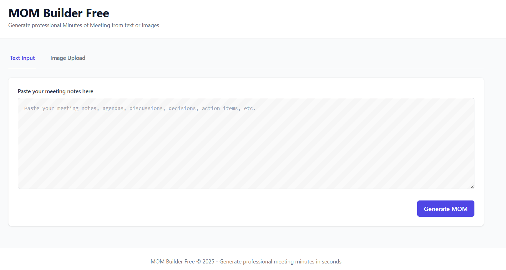
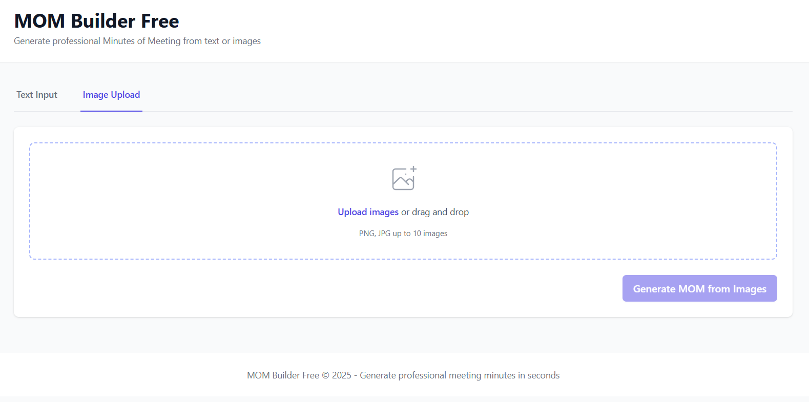

# 📝 MOM Builder Free

<div align="center">


**Generate professional Minutes of Meeting (MOM) from text or images using Google Gemini 2.5 Flash AI**

[🚀 Quick Start](#-quick-start) • [📖 Documentation](#-documentation) • [🎯 Features](#-features) • [🛠️ Tech Stack](#️-tech-stack) • [🤝 Contributing](#-contributing)

</div>

---

## 🎯 Features

✨ **Dual Input Modes**
- 📝 **Text Input**: Paste meeting notes directly
- 🖼️ **Image Upload**: Upload 1-10 images of handwritten notes

🤖 **AI-Powered Processing**
- 🧠 Google Gemini 2.5 Flash integration
- 🔍 Advanced OCR for handwritten text
- 📋 Structured MOM generation

🎨 **Modern Interface**
- 📱 Responsive design for all devices
- 🎯 Clean, professional UI
- ⚡ Real-time processing status
- 📥 Downloadable Markdown output

🔒 **Privacy & Security**
- 🛡️ Secure, temporary processing
- 🌍 IST timezone handling
- 🔐 No data storage

---

## 📸 Interface Screenshots

### Text Input Interface


### Image Upload Interface


---

## 🚀 Quick Start

### Prerequisites
- Python 3.8 or higher
- Google Gemini API key ([Get one here](https://makersuite.google.com/app/apikey))

### 1️⃣ Clone the Repository
```bash
git clone https://github.com/yourusername/mom-builder-free.git
cd mom-builder-free
```

### 2️⃣ Set Up Backend (FastAPI)
```bash
cd backend
pip install -r requirements.txt

# Create .env file
echo "GEMINI_API_KEY=your_gemini_api_key_here" > .env
echo "PORT=8000" >> .env

# Start backend server
python main.py
```

### 3️⃣ Set Up Frontend (Flask)
```bash
# In a new terminal
cd frontend
pip install -r requirements.txt

# Create .env file
echo "SECRET_KEY=your-secret-key-here" > .env
echo "BACKEND_URL=http://localhost:8000" >> .env
echo "PORT=5000" >> .env

# Start frontend server
python app.py
```

### 4️⃣ Access the Application
Open your browser and navigate to: **http://localhost:5000**

---

## 🏗️ Project Structure

```
mom-builder-free/
├── 📁 backend/                 # FastAPI Backend
│   ├── 📁 models/             # Pydantic models
│   ├── 📁 services/           # Business logic
│   ├── 📁 utils/              # Helper utilities
│   ├── 📄 main.py             # FastAPI app entry point
│   └── 📄 requirements.txt    # Python dependencies
├── 📁 frontend/               # Flask Frontend
│   ├── 📁 static/             # CSS, JS, assets
│   ├── 📁 templates/          # Jinja2 templates
│   ├── 📄 app.py              # Flask app entry point
│   └── 📄 requirements.txt    # Python dependencies
├── 📁 assets/                 # Documentation assets
├── 📄 README.md               # Project documentation
└── 📄 .gitignore             # Git ignore rules
```

---

## 🛠️ Tech Stack

### Backend
- **[FastAPI](https://fastapi.tiangolo.com/)** - Modern, fast web framework
- **[Google Generative AI](https://ai.google.dev/)** - Gemini 2.5 Flash integration
- **[Pydantic](https://pydantic.dev/)** - Data validation
- **[Uvicorn](https://www.uvicorn.org/)** - ASGI server

### Frontend
- **[Flask](https://flask.palletsprojects.com/)** - Lightweight web framework
- **[Jinja2](https://jinja.palletsprojects.com/)** - Template engine
- **[Tailwind CSS](https://tailwindcss.com/)** - Utility-first CSS
- **[Marked.js](https://marked.js.org/)** - Markdown parser

---

## 📖 API Documentation

### Endpoints

| Method | Endpoint | Description |
|--------|----------|-------------|
| `GET` | `/` | Root endpoint |
| `GET` | `/api/health` | Health check |
| `POST` | `/api/process-text` | Process text input |
| `POST` | `/api/process-images` | Process image inputs |

### Example Request (Text Processing)
```bash
curl -X POST "http://localhost:8000/api/process-text" \
     -H "Content-Type: application/json" \
     -d '{"text": "Meeting notes here..."}'
```

### Example Response
```json
{
  "success": true,
  "data": {
    "content": "# Minutes of Meeting — Project Kickoff\n\n**Date:** 29-Sep-2025...",
    "format": "markdown"
  }
}
```

---

## 🚀 Deployment

### Backend Deployment Options
- **Docker**: Containerized deployment
- **Cloud Platforms**: AWS, GCP, Azure
- **PaaS**: Heroku, Railway, Render

### Frontend Deployment Options
- **Traditional Servers**: Apache, Nginx
- **Cloud Platforms**: Vercel, Netlify
- **PaaS Solutions**: Heroku, Railway

### Environment Variables
Create `.env` files in both `backend/` and `frontend/` directories:

**Backend `.env`:**
```env
GEMINI_API_KEY=your_gemini_api_key_here
PORT=8000
ENVIRONMENT=production
```

**Frontend `.env`:**
```env
SECRET_KEY=your-secret-key-here
BACKEND_URL=https://your-backend-url.com
PORT=5000
ENVIRONMENT=production
```

---

## 🤝 Contributing

We welcome contributions! Here's how you can help:

1. **Fork** the repository
2. **Create** a feature branch (`git checkout -b feature/amazing-feature`)
3. **Commit** your changes (`git commit -m 'Add amazing feature'`)
4. **Push** to the branch (`git push origin feature/amazing-feature`)
5. **Open** a Pull Request

### Development Setup
```bash
# Install development dependencies
pip install -r requirements-dev.txt

# Run tests
pytest

# Format code
black .
isort .
```

---

## 📄 License

This project is licensed under the **MIT License** - see the [LICENSE](LICENSE) file for details.

---

## 🙏 Acknowledgments

- **[Google Gemini](https://ai.google.dev/)** for providing the AI capabilities
- **[Biz4Group](https://biz4group.com/)** for the initial development
- **Open Source Community** for the amazing tools and libraries

---

## 📞 Support

- 🐛 **Bug Reports**: [Create an issue](https://github.com/yourusername/mom-builder-free/issues)
- 💡 **Feature Requests**: [Start a discussion](https://github.com/yourusername/mom-builder-free/discussions)
- 📧 **Contact**: [your-email@example.com](mailto:your-email@example.com)

---

<div align="center">

**⭐ Star this repository if you find it helpful!**

Made with ❤️ by [Your Name](https://github.com/yourusername)

</div>